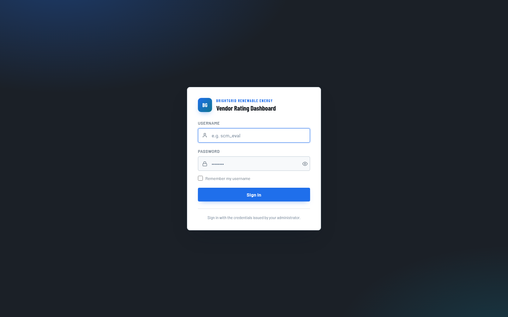
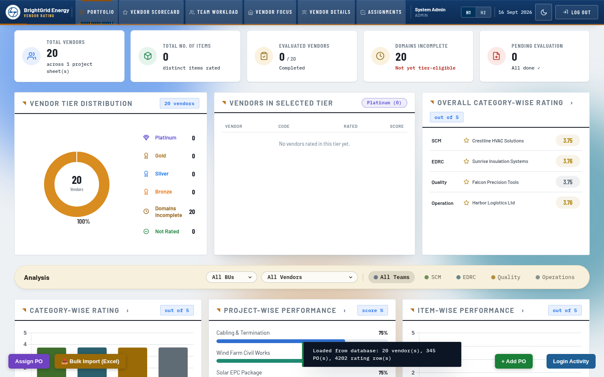
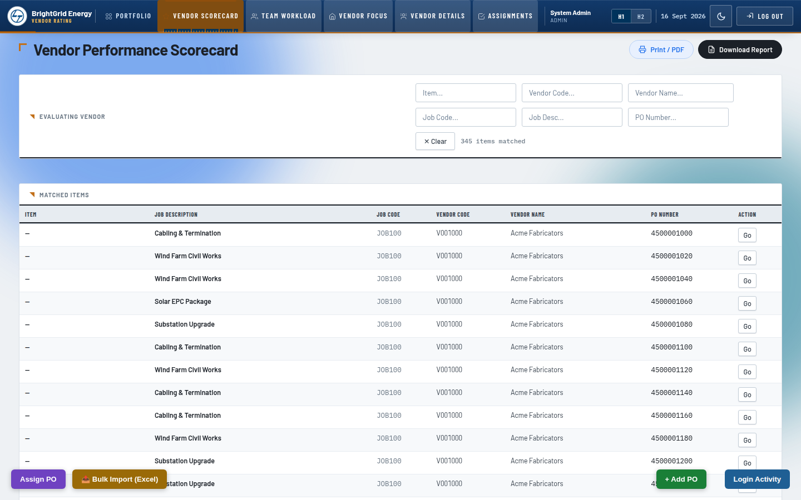
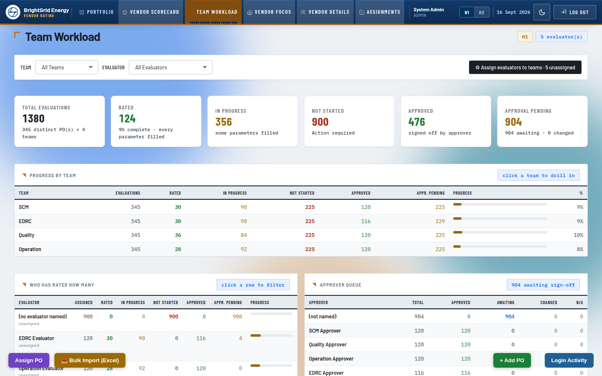
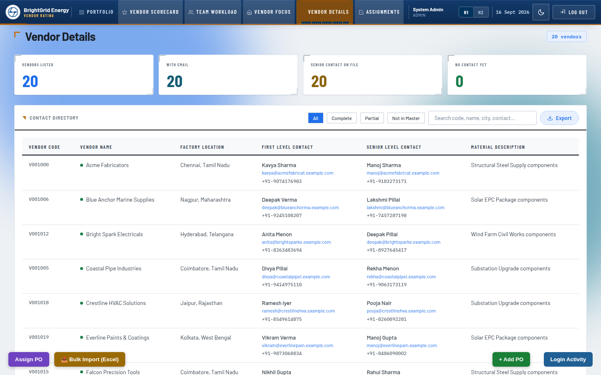

# Vendor Performance Rating (VPR) Dashboard

A full-stack dashboard for rating vendor performance across multiple
evaluation teams (SCM, EDRC, Quality, Operations) on purchase orders — built
as a portfolio project.

> **Note on data:** this is a sanitized, standalone version of a project
> originally built for a real organization. All company branding, vendor
> records, purchase orders, and user accounts in this repo are **synthetic**
> — fictional names, fake addresses, `@example.com` emails, and generated
> sample data — generated to match the original schema so the app runs and
> demos correctly with no real business or personal data involved.

## Screenshots

| Login | Portfolio overview |
|---|---|
|  |  |

| Vendor scorecard | Team workload |
|---|---|
|  |  |

**Vendor contact directory**


## Stack

- **Backend** (`backend/`): Node.js + Express, MySQL, JWT auth, bcrypt
  password hashing, rate limiting. See `backend/README.md` for setup.
- **Frontend** (`frontend/`): Vanilla JS + Chart.js + Leaflet + SheetJS,
  no build step — open `frontend/vendor_rating.html` directly, or serve it
  statically. See `frontend/docs/` for the original setup notes.

## What it does

- Imports vendor and purchase-order data (one-time, from Excel) into MySQL
- Lets evaluators score vendors per category (SCM / EDRC / Quality /
  Operations) and rating period (H1/H2), with an approver sign-off workflow
- Tracks rating history/versioning, login activity, and account lockouts
- Generates vendor scorecards and reports, plus a world map view of vendor
  locations
- Supports bulk Excel import/export alongside the primary API-driven flow

## Quick start

```bash
cd backend
cp .env.example .env   # set your own MySQL password + JWT secret
npm install
mysql -u root -p vpr < schema.sql   # after: CREATE DATABASE vpr;
npm run seed            # loads the synthetic sample POs/vendors
npm run seed:users       # creates starter login accounts (see console output)
npm start
```

Then open `frontend/vendor_rating.html` in a browser.

## Project background

This project began as an offline Excel/localStorage dashboard and was later
migrated to a proper MySQL-backed API (this repo) so that PO, rating, and
evaluator data no longer live in spreadsheets. The synthetic dataset here
preserves that migration story and the app's full feature set without
exposing any real organization's data.
